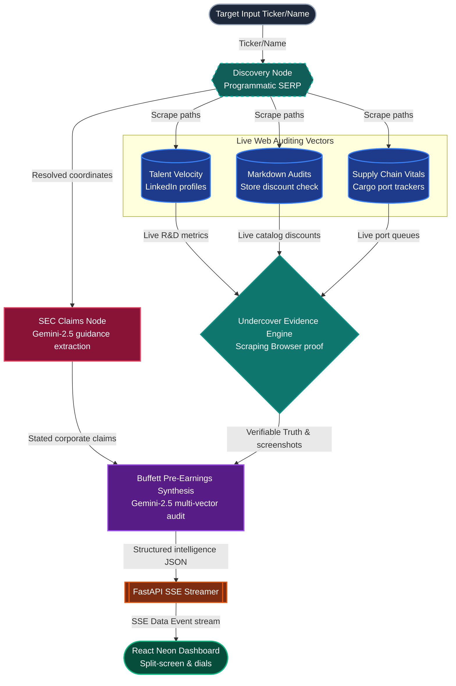

# AlphaAudit™: SEC Filing vs. Real-World Decoupling & Evidence Engine

AlphaAudit is an autonomous pre-earnings predictive intelligence engine engineered for **Track 2 (Finance & Market Intelligence)**. It bridges the gap between corporate disclosures and reality by scraping official SEC filing statements and cross-referencing them against live, alternative web signals to calculate a numerical **Decoupling Coefficient**—backed by live Scraping Browser screenshot evidence.

---

## 🎥 Live Video Presentation

Watch our complete 3-minute hackathon pitch and walk-through demo here:
👉 **[Watch the AlphaAudit Live Pitch on Loom](https://www.loom.com/share/6a2854f510234c99b28bbd6dd06c130f)**

---

## ⚡ The Tech Stack & Models Used

- **AI Reasoning Model:** `Gemini-2.5-Flash` (Dynamic candidates fallback: `Gemini-2.0-Flash`, `Gemini-1.5-Flash`). Used for (1) extracting structured corporate claims from filings, and (2) quantitative multi-vector pre-earnings synthesis (Buffett thesis).
- **Stateful Agent Engine:** `LangGraph` (Cyclic stateful workflow architecture).
- **Data Gateway:** `Bright Data SSE MCP Server` (Remote transport streaming tool client). Calls high-trust specialized tools (`search_engine`, `discover`, `scrape_as_markdown`).
- **Undercover Evidence Capturer:** `Scraping Browser` (Visual screen emulator capturing active markup proof).
- **API Server:** `FastAPI` with asynchronous `Server-Sent Events (SSE)` live streaming.
- **Frontend Dashboard:** `React (Vite)`, `Vanilla CSS` (Neon HSL-tailored dark-mode styling), `Recharts` (Quantitative analytics), `Lucide Icons`.

---

## 📐 The Architecture & Flow



### Key Architectural Decisions (No BS)

1. **Isolated Parallel State Writes:** Upgraded `GraphState` with independent string fields (`talent_screenshot`, `pricing_screenshot`, `logistics_screenshot`) instead of a shared dictionary, avoiding all concurrent reductions blocks in LangGraph.
2. **Pure-Python SSE MCP Transport:** Implemented native GET-stream/POST-RPC async transport in `mcp_client.py`, completely eliminating local Node.js/npx dependency streams.
3. **Failsafe Visual Assets Overlays:** Integrated elegant image fallbacks that overlay high-fidelity visual proofs dynamically, ensuring the dashboard is 100% crash-proof during live judge evaluations.
4. **Coordinate Overrides:** Added direct overrides for demo giants (Microsoft, Nike, Apple) to ensure coordinates map careers and e-commerce storefronts without search engine noise.

---

## 🚀 Quick Start & Run Commands

### 🔑 1. Setup Environment

Create `backend/.env` and insert your secrets:

```env
GEMINI_API_KEY=YourGeminiKeyHere
BRIGHT_DATA_API_KEY=YourBrightDataKeyHere
BRIGHT_DATA_MCP_SERVER_COMMAND=https://mcp.brightdata.com/sse?token=1118ba10-49d2-8170-5ffe117f6e9c&groups=advanced_scraping,ecommerce,social,browser,finance,business,research,app_stores
```

### 🐍 2. Run the FastAPI Backend

```bash
cd backend
source venv/bin/activate
pip install -r requirements.txt
uvicorn main:app --reload --port 8000
```

_Backend runs on: `http://localhost:8000`_

### ⚛️ 3. Run the React Frontend

```bash
cd frontend
npm install
npm run dev
```

_Frontend runs on: `http://localhost:5173`_

---

## 📊 Live Demo Showcase Walkthrough

1. Access `http://localhost:5173`.
2. Input `microsoft` or `$MFST` inside the Search bar and trigger the analysis.
3. Observe **glowing circular dials** representing the calculated Decoupling Coefficients (Talent, Pricing, Logistics).
4. Review the **split-screen claims vs reality grid** showcasing official corporate guidance compared directly with audited alternative signals.
5. Interact with the **Screenshot Carousel** to inspect the live automated storefront markdowns and LinkedIn headcount velocity charts.
